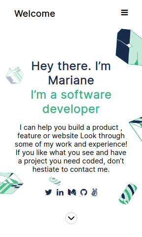
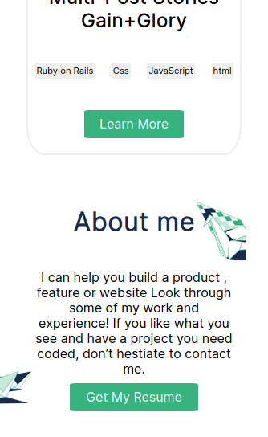

# Portfolio

## This project is my Portfolio page and its mobile version.
The new feature is the mobile menu that **cover the whole** page when *clicked* on it using javascript
and improved the structure of the page.

## Built With HTML5, CSS, Javascript

[Live Demo Link]( https://simongrchevski.github.io/Portfolio/ )

## Getting Started

Clone the project from the console with command $git clone https://github.com/SimonGrchevski/Portfolio/tree/development
cd into the Portfolio rep.
In terminal write $code .
Open the live server

Prerequisites

    Vs code Studio
    
Authors

:bust_in_silhouette: **Simon Grcevski**

[GitHub]( https://github.com/SimonGrchevski )
[LinkedIn]( https://www.linkedin.com/in/simon-grchevski-682935209/ )

handshake Contributing Contributions, issues, and feature requests are welcome!

Show your support Give a star if you like this project!
